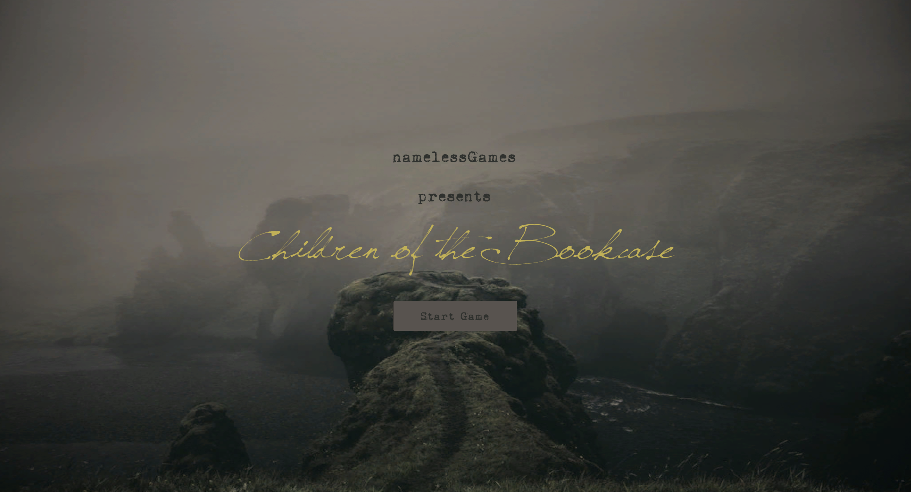

# [Children of the Bookcase](https://play.unity.com/p/children-of-the-bookcase/)

 

You find yourself alone and disorientated in a mysterious room... use your detective skills to uncover your means of escape!

 

  

 

Children of the Bookcase is a 3D, first-person, escape-room style detective puzzle game. Built by **_namelessGamesInc_** in under two weeks for our CodeClan Capstone project, in March 2023.

 

To play our game click below - to see how we built it, take a look at our repo!

 

## Play the Game
Play here: [Children of the Bookcase](https://play.unity.com/p/children-of-the-bookcase/)
 

### Controls
- W,A,S,D (or Arrow keys): Move forward, left, back, right.  
- Space bar: Jump.  
- Mouse movement: In main room, cursor is locked and movement makes the player look around. When focused on a specific object, cursor is not locked and can be freely moved to investigate objects in view.  
- Left mouse click: Investigate an object, including selecting an object from the inventory. Note, when the player has free movement the cursor is locked to the white reticle in the centre of the screen.  
- Right mouse click: Will auto-complete any dialogue currently being output.

 
 
  

  

 

 
 

## Our Brief

As part of our CodeClan Capstone project we created a brief, outlining our game concept and targets. 

> Build a desktop game that we would want to play ourselves. To be designed as the first chapter of a larger story.

 
To achieve this, the game should:

  

> - Be built on the Unity platform (in C#), we had to learn this platform and language from scratch!
> - Be a 3D, first-person escape-room style game where the player has free movement to explore the room;
> - Allow interaction with key objects in the room that focuses the player's view and allows further interactions with objects / puzzles;
> - Contain collectable items that are available in an on-screen inventory once collected;
> - Deliver narrative and clues to the player via a dynamic, on-screen dialogue box;
> - Have a start menu and end credits.

 

Within the timeframe of the project, we were also able to:
- Incorporate additional dialogue prompts, for non-key objects
- Add background music
- Add visual effects to the main camera.

 

### Future Plans
We're really proud of how much we achieved (and in such a short time!) but we're just getting started. There is so much more that we can't wait to build into this game. Here are some of our future objectives:
- Adding an in-game guide to player controls
- An option for hints
- Pause menu, including current hints and found clues/ objects
- A 'Play Again' button at the end of the credits (we know you'll want to!)
- More interactions with objects (including small animations to non-key objects when investigated)
- Increasing the complexity of the puzzles (e.g. a slider to "tune" the radio, and other secrets...)
- Improve dialogue flow ("stack" dialogue from multiple clicks)
- Dynamic interactions, (eg. different dialogue when the same object is clicked multiple times)
- Chapter 2: The Quaternion Cave!!
  

## Software Information
This game was developed using Unity v2021.3.19f1. We used Visual Studio Code to write the C# scripts and manage merge conflicts.
  

## Contributors
Charlotte Broadley ([Github](https://github.com/charbroadley); [LinkedIn](https://www.linkedin.com/in/charbroadley/))   
Indira Borràs González ([Github](https://github.com/Laufley); [LinkedIn](https://www.linkedin.com/in/indira-borras/))   
Louise Cuthbertson ([Github](https://github.com/louise3112); [LinkedIn](https://linkedin.com/in/louise3112/))   
Samuel Williams ([Github](https://github.com/samuel-williams-ed); [LinkedIn](https://www.linkedin.com/in/samuel-williams-ed/))   

